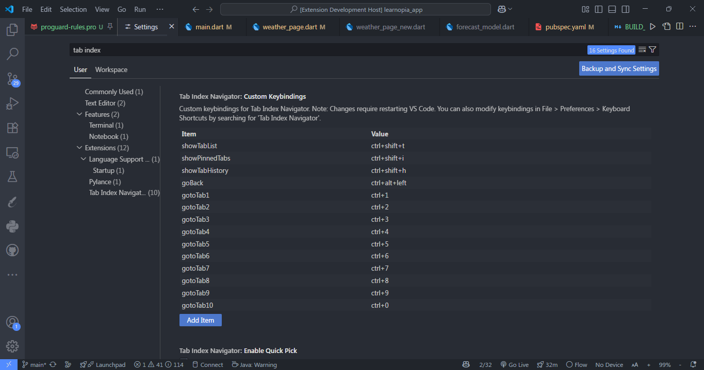

# 🔧 Fix VS Code Marketplace Image Display Issue

## 🚨 **The Problem**
VS Code Marketplace cannot display images with relative paths like `media/image.png`. Only the extension icon works because it's referenced in package.json.

## ✅ **Solution Applied**
I've updated your README.md to use GitHub raw URLs for all images:

### **Before (Broken on Marketplace):**
```markdown


```

### **After (Works on Marketplace):**
```markdown


```

## 🚀 **Steps to Fix Your Marketplace Listing**

### 1. **Push Code to GitHub First**
```bash
git add .
git commit -m "Fix image paths for VS Code Marketplace"
git push origin main
```

### 2. **Verify GitHub Repository**
- Go to: https://github.com/TanvirAnjumApurbo/tab-index-navigator
- Make sure the `media/` folder with all images is uploaded
- Test one image URL in browser:
  ```
  https://raw.githubusercontent.com/TanvirAnjumApurbo/tab-index-navigator/main/media/tab_index_gif.gif
  ```

### 3. **Update Marketplace Extension**
Option A - **Publish New Version (Recommended):**
```bash
vsce publish
```

Option B - **Manual Upload:**
- Go to https://marketplace.visualstudio.com/manage
- Find your extension
- Upload the new `tab-index-navigator-0.0.2.vsix` file

### 4. **Update CHANGELOG**
Add this to your CHANGELOG.md:
```markdown
### v0.0.2
- 🔧 Fixed image display issues on VS Code Marketplace
- 📷 Updated README with proper image URLs
```

## 🔍 **Why This Happens**

1. **Extension Icon**: Works because it's in `package.json` and packaged in the `.vsix`
2. **README Images**: Marketplace renders README separately and can't access relative paths
3. **GitHub Raw URLs**: Marketplace can fetch images from public GitHub repositories

## ⚠️ **Important Notes**

- **Wait 5-10 minutes** after pushing to GitHub before publishing
- **Test image URLs** in browser first to ensure they work
- **Images must be on `main` branch** for raw URLs to work
- **Keep images under 5MB** for faster loading

## 🎯 **Expected Result**
After following these steps:
- ✅ Extension icon: Working
- ✅ Demo GIF: Working  
- ✅ Screenshots: Working
- ✅ All images display properly on marketplace

Your updated package is ready: `tab-index-navigator-0.0.2.vsix`
